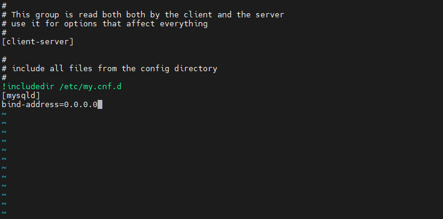

# Web Solution With WordPress  
## Step 1 - Prepare a Web Server  
- Launch an EC2 instance that will serve as "Web Server". Create 3 volumes in the same AZ as your Web Server EC2, each of 10 GiB.  
  
  

- Attach all three volumes one by one to your Web Server EC2 instance


- Open up the Linux terminal to begin configuration

- Use `lsblk` command to inspect what block devices are attached to the server. Notice names of your newly created devices. All devices in Linux reside in /dev/ directory. Inspect it with `ls /dev/` and make sure you see all 3 newly created block devices there – their names will likely be `xvdf, xvdh, xvdg`.

- Use `df -h` command to see all mounts and free space on your server

- Use `gdisk` utility to create a single partition on each of the 3 disks `sudo gdisk /dev/xvdf`   
   


- Use `lsblk` utility to view the newly configured partition on each of the 3 disks.

- Install `lvm2` package using `sudo yum install lvm2`. Run `sudo lvmdiskscan` command to check for available partitions.
Note: Previously, in Ubuntu we used apt command to install packages, in RedHat/CentOS a different package manager is used, so we shall use yum command instead.   
   


- Use `pvcreate` utility to mark each of 3 disks as physical volumes (PVs) to be used by LVM
```
sudo pvcreate /dev/xvdf1
sudo pvcreate /dev/xvdg1
sudo pvcreate /dev/xvdh1
```

- Verify that your Physical volume has been created successfully by running `sudo pvs`
   


- Use `vgcreate` utility to add all 3 PVs to a volume group (VG). Name the VG webdata-vg
```
sudo vgcreate webdata-vg /dev/xvdh1 /dev/xvdg1 /dev/xvdf1
```
- Verify that your VG has been created successfully by running `sudo vgs`


- Use `lvcreate` utility to create 2 logical volumes. apps-lv (Use half of the PV size), and logs-lv Use the remaining space of the PV size. NOTE: apps-lv will be used to store data for the Website while, logs-lv will be used to store data for logs.
```
sudo lvcreate -n apps-lv -L 14G webdata-vg
sudo lvcreate -n logs-lv -L 14G webdata-vg
```
- Verify that your Logical Volume has been created successfully by running `sudo lvs`


-   Verify the entire setup 
```
sudo vgdisplay -v #view complete setup - VG, PV, and LV
sudo lsblk 
```


- Use `mkfs.ext4` to format the logical volumes with ext4 filesystem
```
sudo mkfs -t ext4 /dev/webdata-vg/apps-lv
sudo mkfs -t ext4 /dev/webdata-vg/logs-lv
```


- Create **/var/www/html** directory to store website files

```
sudo mkdir -p /var/www/html
```

- Create **/home/recovery/logs** to store backup of log data
```
sudo mkdir -p /home/recovery/logs
```
- Mount **/var/www/html** on **apps-lv** logical volume
```
sudo mount /dev/webdata-vg/apps-lv /var/www/html/
```

- Use rsync utility to backup all the files in the log directory **/var/log** into **/home/recovery/logs** *(This is required before mounting the file system)*
```
sudo rsync -av /var/log/. /home/recovery/logs/
```


- Mount **/var/log** on **logs-lv** logical volume. *(Note that all the existing data on /var/log will be deleted. That is why step 15 above is very
important)*
```
sudo mount /dev/webdata-vg/logs-lv /var/log
```
- Restore log files back into **/var/log** directory
```
sudo rsync -av /home/recovery/logs/. /var/log
```
   
   
- Update `/etc/fstab` file so that the mount configuration will persist after restart of the server. The UUID of the device will be used to update the `/etc/fstab file` 
```
sudo blkid
```
```
sudo vi /etc/fstab
```
Update `/etc/fstab` in this format using your own UUID and rememeber to remove the leading and ending quotes.

- Test the configuration and reload the daemon
```
sudo mount -a
sudo systemctl daemon-reload
```
- Verify your setup by running `df -h`


## Step 2 — Prepare the Database Server
Launch a second RedHat EC2 instance that will have a role – ‘DB Server’
Repeat the same steps as for the Web Server, but instead of `apps-lv` create `db-lv` and mount it to `/db` directory instead of `/var/www/html/`.


## Step 3 — Install WordPress on your Web Server EC2
- Update the repository
```
sudo yum -y update
```
- Install wget, Apache and it’s dependencies
```
sudo yum -y install wget httpd php php-mysqlnd php-fpm php-json
```
- Start Apache
```
sudo systemctl enable httpd
sudo systemctl start httpd
```
- To install PHP and it’s depemdencies
```
sudo yum install https://dl.fedoraproject.org/pub/epel/epel-release-latest-8.noarch.rpm
sudo yum install yum-utils http://rpms.remirepo.net/enterprise/remi-release-8.rpm
sudo yum module list php
sudo yum module reset php
sudo yum module enable php:remi-7.4
sudo yum install php php-opcache php-gd php-curl php-mysqlnd
sudo systemctl start php-fpm
sudo systemctl enable php-fpm
setsebool -P httpd_execmem 1
```
- Restart Apache

`sudo systemctl restart httpd`


- Download wordpress and copy wordpress to var/www/html
```
mkdir wordpress
cd   wordpress
sudo wget http://wordpress.org/latest.tar.gz
sudo tar xzvf latest.tar.gz
sudo rm -rf latest.tar.gz
cp wordpress/wp-config-sample.php wordpress/wp-config.php
cp -R wordpress /var/www/html/
```
- Configure SELinux Policies
```
sudo chown -R apache:apache /var/www/html/wordpress
sudo chcon -t httpd_sys_rw_content_t /var/www/html/wordpress -R
sudo setsebool -P httpd_can_network_connect=1
```
- Install `mysql` so webserver acts as a client   
```
sudo yum install mysql-server
sudo systemctl restart mysqld
sudo systemctl enable mysqld
```

## Step 4 — Install MySQL on your DB Server EC2
```
sudo yum update
sudo yum install mysql-server
```
Verify that the service is up and running by using `sudo systemctl status mysqld`, if it is not running, restart the service and enable it so it will be running even after reboot:
```
sudo systemctl restart mysqld
sudo systemctl enable mysqld
```
## Step 5 — Configure DB to work with WordPress
```
sudo mysql
sudo mysql_secure_installation
CREATE DATABASE wordpress;
CREATE USER `wordpress`@`%` IDENTIFIED WITH mysql_native_password BY 'password';
GRANT ALL PRIVILEGES ON *.* TO 'wordpress'@'%' WITH GRANT OPTION;
FLUSH PRIVILEGES;
SHOW DATABASES;
exit
```

  **Note:** *`%` above should be replaced with IP address of webserver for security purpose. Grant could be done by `GRANT ALL ON wordpress.* TO 'myuser'@'<Web-Server-Private-IP-Address>';` To show users on mysql use `select user, host from mysql.user;`*


- Edit `binding address`
```
sudo vi /etc/my.cnf
```


- restart mysql `sudo systemctl restart mysqld`  


## Step 6 — Configure WordPress to connect to remote database.
**Hint**: Do not forget to open MySQL `port 3306` on DB Server EC2. For extra security, you shall allow access to the DB server ONLY from your Web Server’s IP address, so in the Inbound Rule configuration specify source as /32

- On the Webserver, edit database name, user name, password, and IP of remove DBserver in wordpress config file `sudo vi wp-config.php` in /var/www/html


- restart `httpd` on webserver `sudo systemctl restart httpd`

- disable apache welcome page
```
sudo mv /etc/httpd/conf.d/welcome.conf /etc/httpd/conf.d/welcome.conf_backup
```
- restart `httpd` on webserver `sudo systemctl restart httpd`

- Install MySQL client and test that you can connect from your Web Server to your DB server by using mysql-client
```
sudo yum install mysql
sudo mysql -u wordpress -p -h <DB-Server-Private-IP-address>
```
- Verify if you can successfully execute SHOW DATABASES; command and see a list of existing databases.   


- Change permissions and configuration so Apache could use WordPress:
```
sudo chown -R apache:apache /var/www/html
sudo chcon -t httpd_sys_rw_content_t /var/www/html -R
sudo setsebool -P httpd_can_network_connect=1
sudo setsebool -P httpd_can_network_connect_db 1
```

- Enable TCP port 80 in Inbound Rules configuration for your Web Server EC2 (enable from everywhere 0.0.0.0/0 or from your workstation’s IP)

- Try to access from your browser the link to your WordPress `http://<Web-Server-Public-IP-Address>`   

   


- Fill out your DB credentials:


Important: Do not forget to STOP your EC2 instances after completion of the project to avoid extra costs.

CONGRATULATIONS!
You have learned how to configure Linux storage susbystem and have also deployed a full-scale Web Solution using WordPress CMS and MySQL RDBMS!


